# Task 1: A/B Test Simulation on Difficulty Flow

I simulated an A/B test for two game difficulty flow variants (A and B), assuming:
*	Each variant receives 20,000 installs per day
*	Analysis horizon: 30 days
*	Revenue sources:
*	In-App Purchases (IAP)
*	Ad Monetization
*	Retention provided at D1, D3, D7, D14
*	Retention between checkpoints estimated using log-linear interpolation, assuming exponential decay consistent with standard mobile gaming dynamics.

All simulations were implemented using a reusable engine structure ab_test_engine.py and executed in 01_task1_ab_test_simulation.ipynb.

# Retention Interpolation Methodology 

Retention was provided at discrete checkpoints (D1, D3, D7, D14).
To estimate retention for intermediate days, I applied log-linear interpolation, assuming exponential decay behavior.

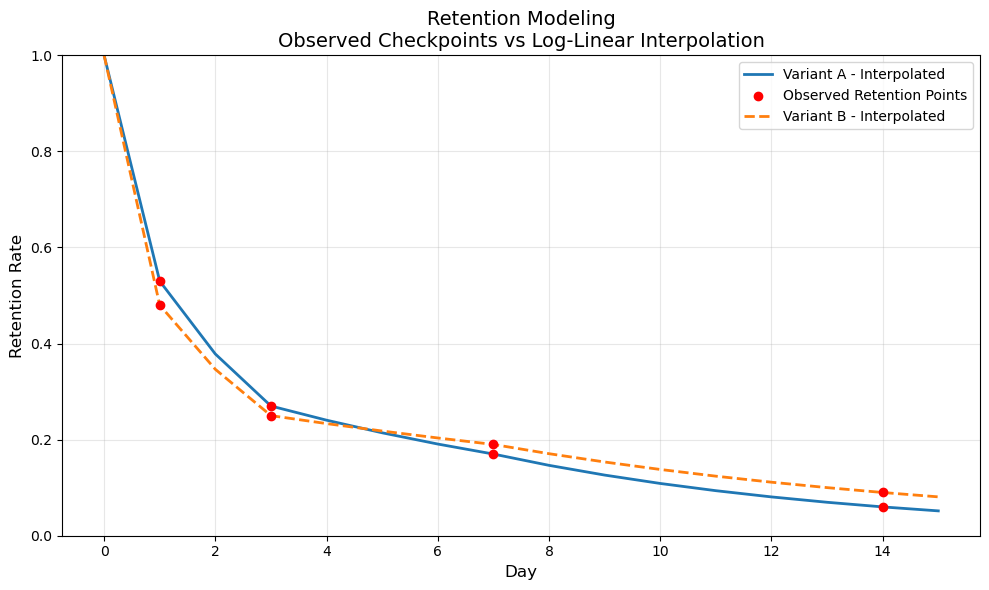

* Variant A performs better in early retention (D1–D3), resulting in stronger short-term user accumulation.
* Variant B performs better in mid-to-late retention (D7–D14), showing a slower decay rate and stronger long-term user stickiness.

# a) Which variant will have the most daily active users after 15 days?
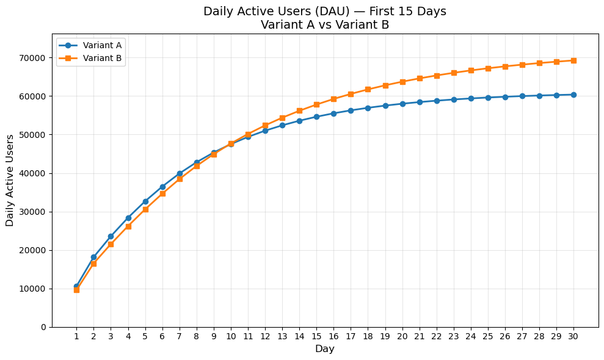

The figure shows simulated DAU for Variant A and Variant B over the first 30 days, assuming 20,000 daily installs and interpolated retention curves.

* Variant A starts stronger during the first 7–8 days due to higher early retention (D1 and D3).
* Around Day 9–10, Variant B overtakes Variant A.
* From that point onward, Variant B maintains a consistently higher DAU.

# b) Which variant will earn the most total money by Day 15?
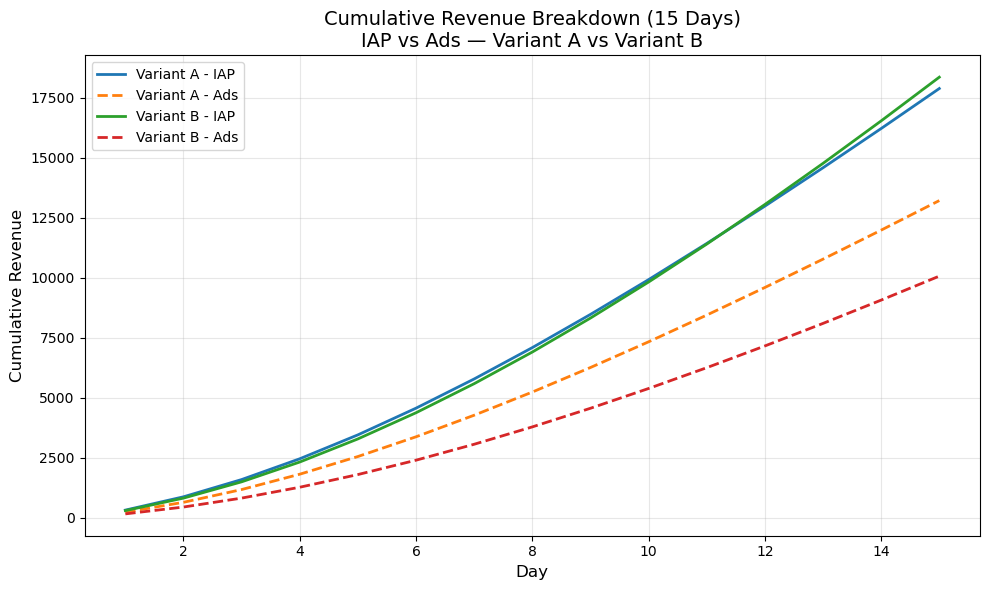
Under the assumption AOV = 1, **Variant A generates higher total revenue by Day 15 (31,100.81 vs 28,427.05), making Variant A the winner in the short term**.
 Retention between checkpoints (D1, D3, D7, D14) was modeled using log-linear interpolation, assuming exponential decay consistent with standard mobile gaming dynamics. Based on this retention modeling and 20,000 daily installs per variant, Variant A benefits from stronger early retention, which drives higher cumulative IAP volume in the first 15 days.
 Total Revenue by Day 15 - Variant A: 31,100.81
 Total Revenue by Day 15 - Variant B: 28,427.05
 Winner: Variant A

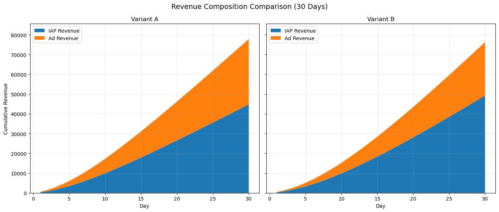
Over the 30-day simulation period, Variant A generates higher total cumulative revenue overall. This is primarily driven by stronger early retention and higher DAU accumulation.
 However, Variant B generates higher IAP revenue specifically, reflecting its stronger purchase ratio and more efficient monetization per user.
 The break-even analysis shows that Variant B would only outperform Variant A if the average purchase value exceeds 6.65, which is significantly above the baseline assumption. Therefore, under realistic AOV levels, Variant A remains the more profitable option by Day 15.

# c) If we look at the total money earned by Day 30 instead, does our choice change?
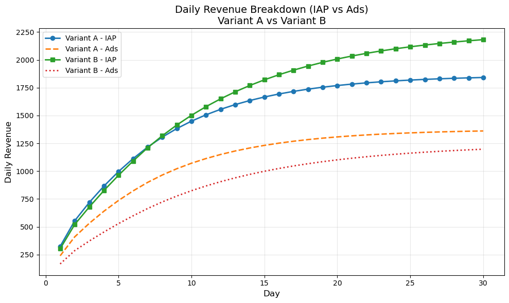
 Although Variant B has better monetization per user, Variant A’s stronger early retention leads to a larger overall user base, which results in higher cumulative revenue.
 Total Revenue by Day 30 - Variant A: 77,787.43
 Total Revenue by Day 30 - Variant B: 76,260.61

# d) What if we run a 10-day sale starting on Day 15 (boosting everyone's purchase rate by
1%)? Does this change which variant earns more total money by Day 30?
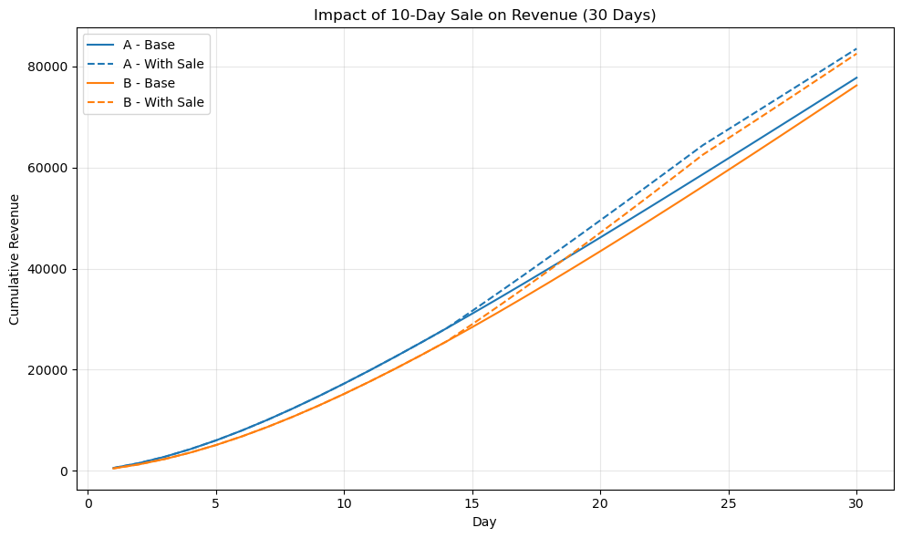
With the 10-day sale starting on Day 15:
 Variant A: 83,533.69
 Variant B: 82,545.77
 Winner with Sale: Variant A

Both variants benefit from the temporary +1% purchase boost. Although Variant B gains slightly more incremental revenue from the sale itself, Variant A still generates higher total revenue by Day 30.

# e) On Day 20 we add a new user source. From then on, we get 12,000 users from the original source and 8,000 from this new one.
 Total Revenue by Day 30 (New Source) - Variant A: 81,266.82
 Total Revenue by Day 30 (New Source) - Variant B: 79,126.72
 Winner with New Source: Variant A
 Incremental Revenue from New Source - A: 3,479.38
 Incremental Revenue from New Source - B: 2,866.11

# f) Which one should you prioritize, and why?
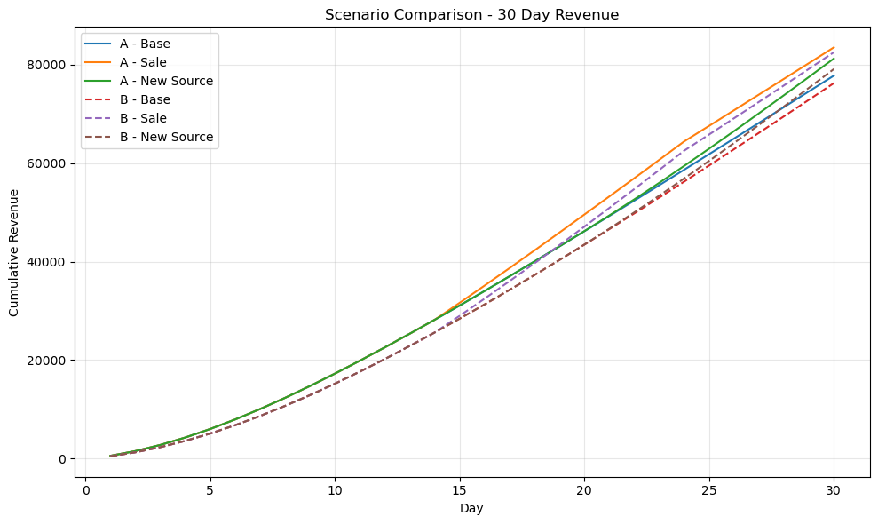
Looking at the scenario comparison plot, both improvements increase revenue compared to the base case. However, the temporary 10-day sale produces the highest revenue by Day 30, as its curve sits slightly above the new source scenario for both variants.
If the goal is sustainable long-term growth, prioritizing the permanent user source may be more suitable.

# Task 2: Behavioral & Monetization Analysis
Using the event-level dataset, I analyzed:
* Session duration trends
* Lifecycle engagement patterns
* Engagement-based segmentation
* Revenue distribution
* Win rate vs monetization relationship
* DAU, MAU, and stickiness metrics

All analyses were implemented in:
* 02_task2.ipynb
* 02_task2_sessions.ipynb
* 02_task2_user_engagement.ipynb

# Active Days Analyses 
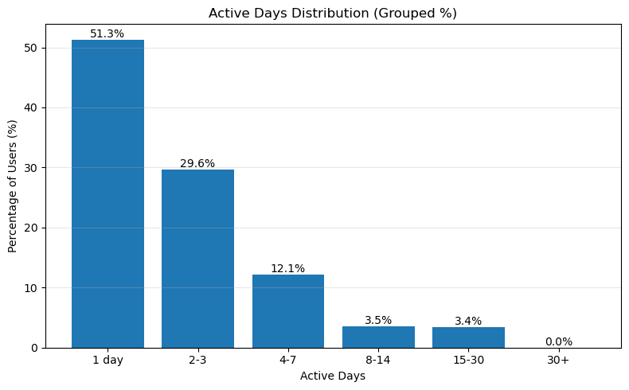
The dataset contains 7,293,526 events across 2,453,499 unique users.

We analyzed the number of distinct active days per user. The results show:
* 51.3% of users were active for only 1 day
* 29.6% for 2–3 days
* 12.1% for 4–7 days
* Less than 7% remained active beyond one week

# Active Days By Platform
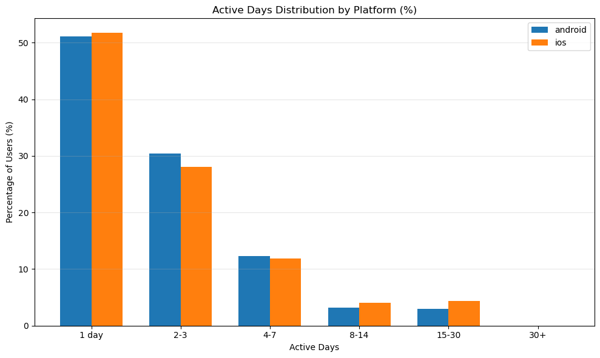
The platform comparison shows very similar engagement patterns across Android and iOS users. In both platforms, more than half of users churn after just one day (around 51–52%), and nearly 80% drop off within the first three days. iOS users show slightly higher proportions in the 8–30 day ranges, indicating marginally stronger mid-term retention. However, overall engagement decay is consistent across platforms, suggesting that early churn is a structural issue rather than platform-specific.

# Retention
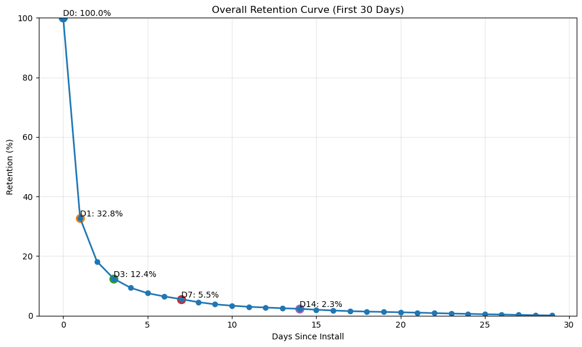
The overall retention curve shows a steep early drop-off, with Day 1 retention at 32.8%, declining to 12.4% by Day 3, 5.5% by Day 7, and 2.3% by Day 14. This indicates significant early churn, with the majority of users leaving within the first few days after installation. After Day 7, the curve flattens, suggesting that users who remain beyond the first week are more stable and likely to continue engaging.

# DAU 
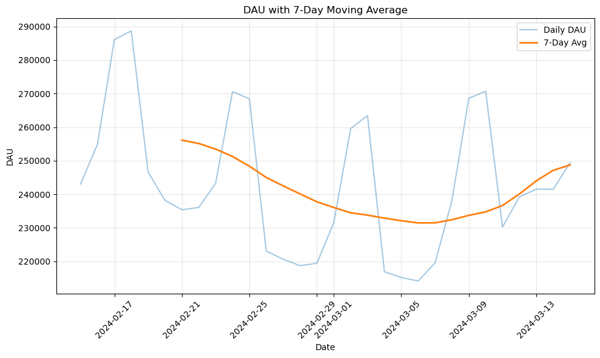
The DAU chart shows noticeable daily fluctuations, with clear periodic peaks and drops, suggesting weekly usage patterns. The 7-day moving average smooths this volatility and reveals the underlying trend: a gradual decline in DAU through late February, followed by stabilization and a mild recovery in mid-March.

# Stickiness
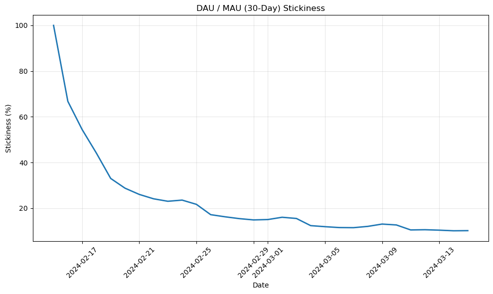
The stickiness metric (DAU/MAU) shows a sharp initial decline, stabilizing around 10–15% over time. The early spike is expected due to the rolling 30-day MAU window not being fully populated. After stabilization, stickiness remains relatively consistent, indicating that approximately 1 out of 10 monthly active users return daily.

# Engagement Segmentation
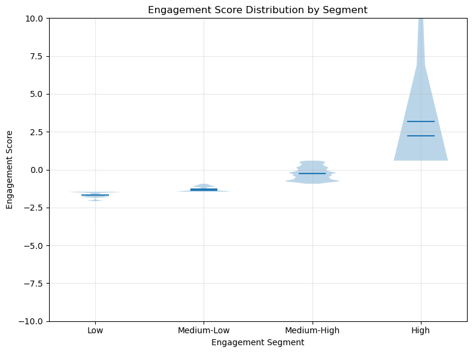
To better understand behavioral differences across users, we segmented the population based on their first-day engagement level. The engagement score was constructed using early activity metrics such as session count, session duration, match activity

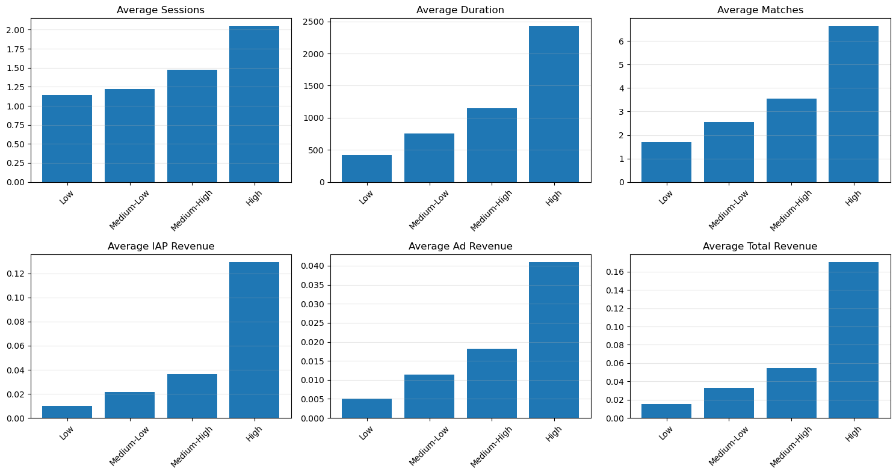
All key metrics increase consistently from Low to High engagement segments. High-engagement users have more sessions, longer playtime, more matches, and significantly higher IAP and total revenue.

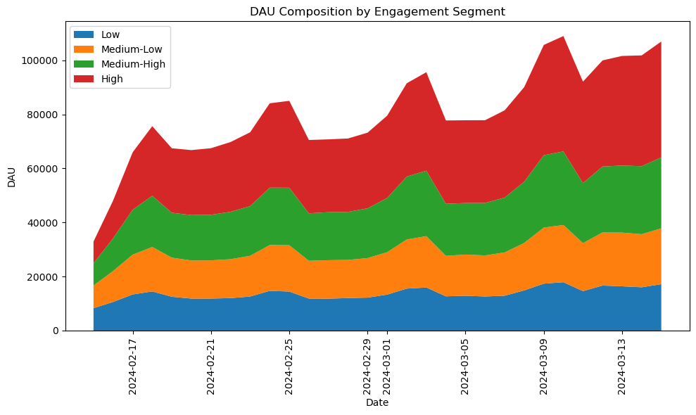
The DAU composition shows that High and Medium-High engagement users contribute the largest share of daily active users over time. While Low-engagement users remain present, growth is primarily driven by higher-engagement segments.

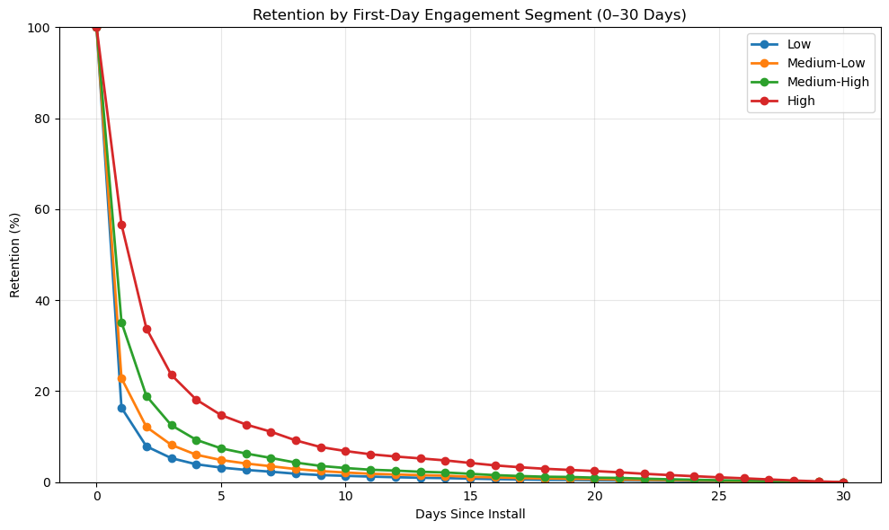
The retention curves clearly show a strong relationship between first-day engagement and long-term retention. Users in the High engagement segment maintain significantly higher retention across all 30 days, while the Low engagement segment drops off rapidly after installation. The separation between segments remains consistent over time, indicating that early engagement quality strongly predicts long-term user survival.

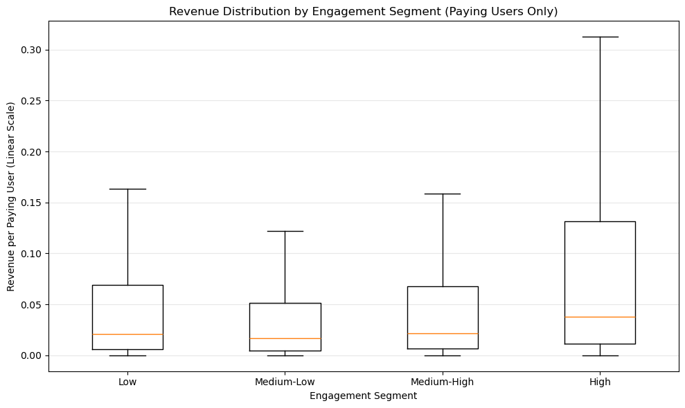
Among paying users, the High engagement segment shows both higher median revenue and a wider revenue spread compared to other groups. While Low and Medium segments generate smaller and more concentrated spending amounts, High-engagement users exhibit greater variability and higher upper-end revenue values.

This indicates that highly engaged users not only spend more on average but also contain the highest-value spenders, reinforcing their critical role in overall monetization performance.

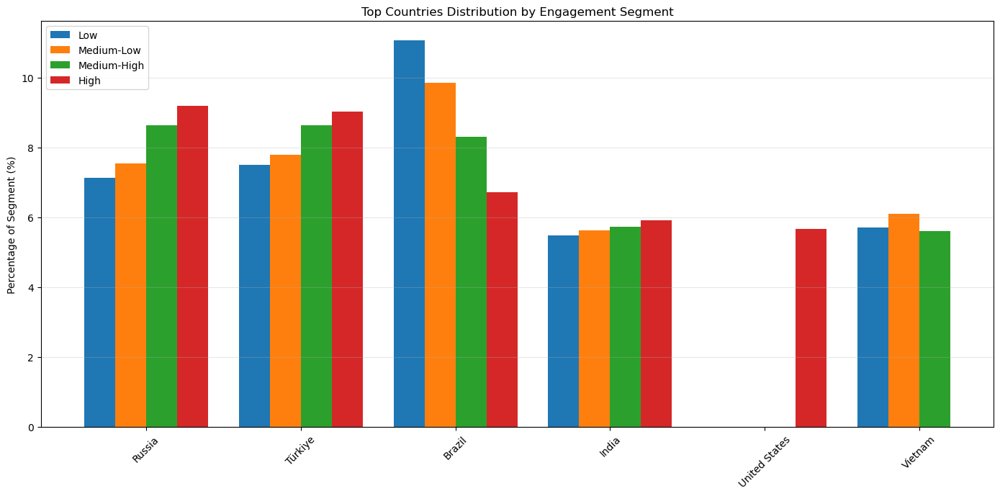
The country distribution shows noticeable differences across engagement segments. Russia and Türkiye have higher representation in the Medium-High and High engagement groups, suggesting stronger user quality from these markets. Brazil, while highly represented overall, has a larger share in the Low engagement segment, indicating higher acquisition volume but lower average engagement depth. The United States appears primarily in the High engagement group, suggesting fewer but more valuable users.

# Session Analyses 
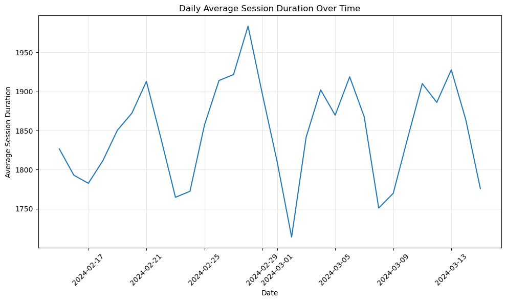
This chart shows that daily average session duration is relatively stable over time, fluctuating within a narrow range.
There is a noticeable drop around early March, followed by a recovery.

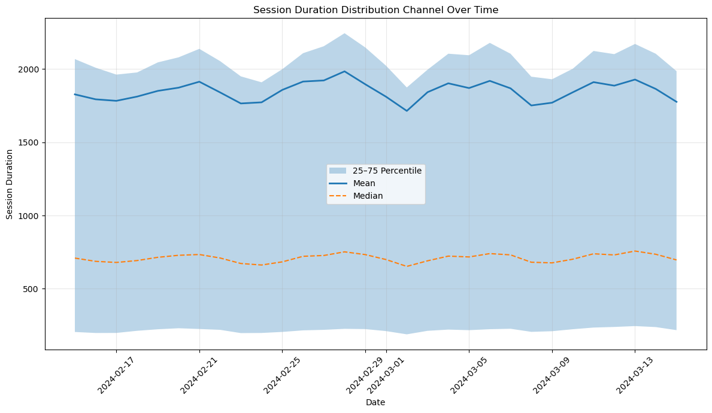
Session duration is relatively stable across the observed period, with mild fluctuations but no strong upward or downward trend. The mean remains consistently above the median, indicating a right-skewed distribution driven by some longer sessions.

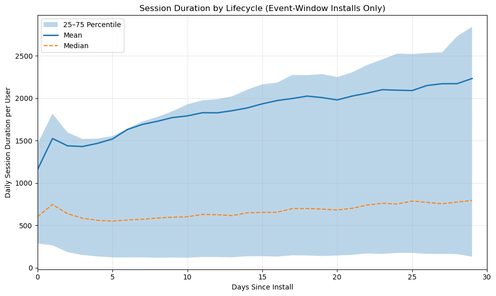
The lifecycle analysis shows that average session duration gradually increases over the first 30 days after installation. Both the mean and median trend upward, indicating that users who survive the early churn phase tend to engage more deeply over time. The 25–75 percentile band also widens slightly, suggesting increasing variability among retained users.

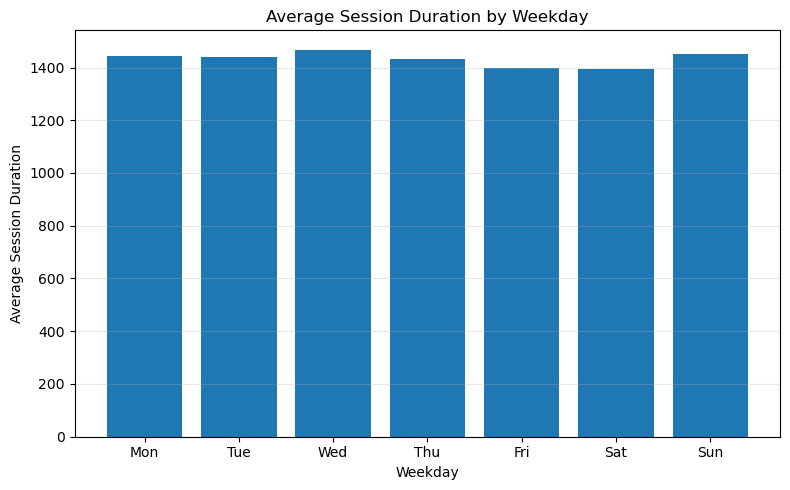
Average session duration remains relatively stable across weekdays, with only minor variation between days. Midweek (especially Wednesday) shows slightly higher average session length, while Friday and Saturday are marginally lower. Overall, there is no strong weekday seasonality effect.

# Additional 

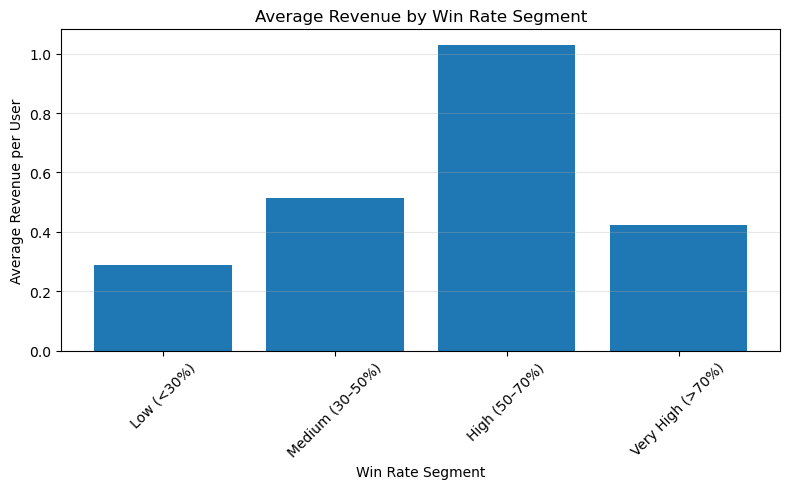
 The optimal monetization zone appears to be a balanced win rate (50–70%), where players are engaged but still motivated to improve.

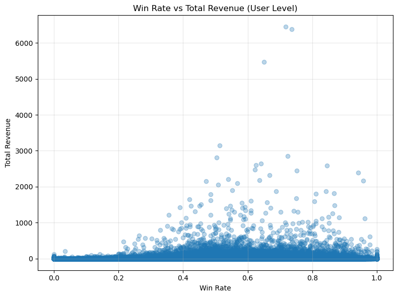
 Users with extremely high win rates (~100%) do not generate the highest revenue. Instead, the highest spenders tend to have moderate-to-high win rates, not perfect ones.